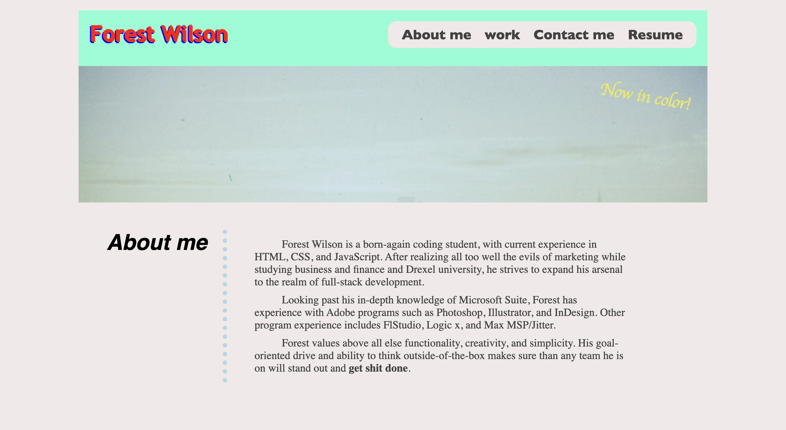
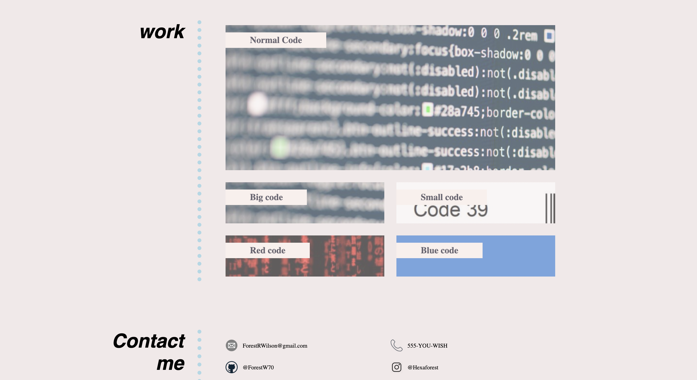

## Forest Wilson - Homework 2 - Portfolio

Hello world. Welcome to v1.0 of my portfolio page. I hope you enjoy.

## Bugs

I had some things stop working how I expected them to when adding additional features. for instance, you'll notice that the nav bar holding my page-content links disappears behind the cover picture when you are resizing the window. originally I liked how it looked when it wrapped after running out of room, and it was working great, but when I changed the blurb to show up on the cover picture using position absolute/relative, the navbar decided to hide behind the cover image at smaller dimentions. I tried using the z-index property to move it to the front, but after messing with it a bit and it still not working, i decided to leave it as it. I believe I can get it to display in the front again by changing where the position: relative targets, but I will have to explore than in later versions.

I notice that at certain resolutions before the media query can take effect, my <section, h2> headers will clip into the dotted border before it switches to display:block. I dont think this will be a hard fix, messing with the queries' breakpoints, but I could spend all day tweaking little things that dont effect functionality. V2 will possess more streamlined queries.

*general spelling errors. life is hard without auto-correct :(

## Additional comments

I appologize for the late delivery of this project. I was having a hard time with creating the display that I wanted for the page, but thankfully I had a revaltion in my display methods that allowed me to get what I wanted. Also I have a hard time not being a perfectionist about little things so I probably spend way to much time adjusting things that did not effect the functionality. I hope this will page will be satisfactory.

As of now, none of my work articles link to any deployed projects. I am eager to fill these boxes with actual projects and I am excited to continue work on this site. 

Maybe one day I will be less fearful of cameras and have a headshot here as well. 

## Screenshots

## Relevant link

